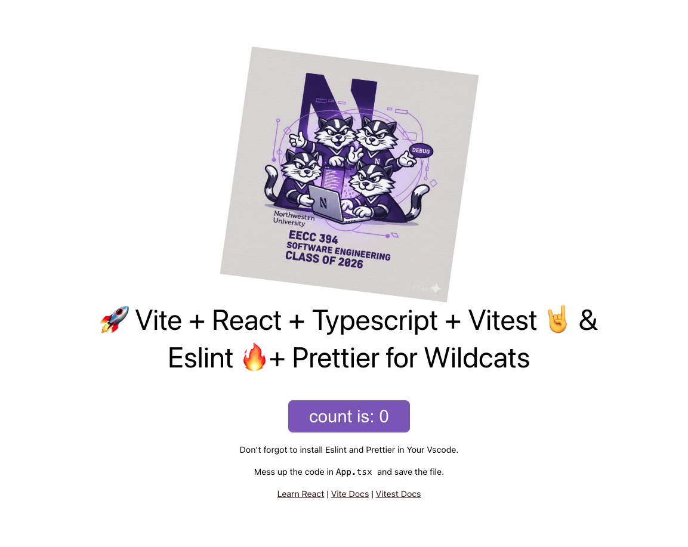

# CompassAI

## 1. Project Overview

CompassAI is a web application designed to provide highly accurate reports of code functionality and quality. The product combines error detection and optimization recommendations with consultant-style audit reports.

Key capabilities:

- Program report cards that summarize code quality and functional coverage
- Full reports unlocked after x402 payment, delivering in-depth analysis
- Support for large codebases with high-fidelity audits



## 2. Application Link

- Running application: https://tribe-y.web.app/
- Access: public demo, no credentials are required for the current published version.

## 3. Project Management

- Project backlog: https://github.com/orgs/NUCS394-S2026-2/projects/6

How we use the project tool:

- Track client-facing user stories and MVP deliverables
- Prioritize features such as the consultant agent, C++ expert, report generation, payment flow, and report delivery
- Manage development work with GitHub Issues and project cards for team coordination
- Review and merge work through feature branches and pull requests

## 4. Build & Deployment

### Prerequisites

- Node.js 22+
- npm 10+
- Firebase CLI installed globally if deploying: `npm install -g firebase-tools`

### Local setup

1. Clone the repository:
   ```bash
   git clone https://github.com/NUCS394-S2026-2/tribe-y.git
   cd tribe-y
   ```
2. Install dependencies:
   ```bash
   npm install
   ```
3. Start the development server:
   ```bash
   npm run dev
   ```
4. Open the app in the browser at the local address shown by Vite.

### Build for production

1. Build the app:
   ```bash
   npm run build
   ```
2. Preview the production build locally:
   ```bash
   npm run preview
   ```

### Deploy to Firebase Hosting

1. Authenticate with Firebase:
   ```bash
   firebase login
   ```
2. Deploy the hosting site:
   ```bash
   firebase deploy --only hosting
   ```

## 5. Additional Information

### Architecture & codebase

- UI: React 19 with TypeScript 5.9
- Build: Vite 8
- Styling: CSS Modules
- Backend: Firebase / Firestore for deployment and app state
- Testing: Vitest 4 + React Testing Library
- Linting: ESLint 9 + Prettier

### Coding standards

- Strict TypeScript enabled across the repo
- No `@ts-ignore` or `any` without formal justification
- PRs require implementation notes, screenshots, and testing evidence
- Tribe Y used feature branches and code review before merging

### What changed since Iteration 0

- The repository has moved from starter-template documentation to a working CompassAI app deployment
- Backlog and project management are now tracked in GitHub Projects
- Deployment is configured for Firebase Hosting at `tribe-y.web.app`

## 6. Link to docs

- Team and process documentation: [`docs/tribe/`](docs/tribe/)
- Architecture, design, testing, and story specs: [`docs/agent/`](docs/agent/)
- Canonical agent guidance: [`AGENTS.md`](AGENTS.md)
- Claude-specific instructions: [`CLAUDE.md`](CLAUDE.md)
- Iteration 0 assignment reference: https://canvas.northwestern.edu/courses/251429/assignments/1735407

---

### Repository link

https://github.com/NUCS394-S2026-2/tribe-y
